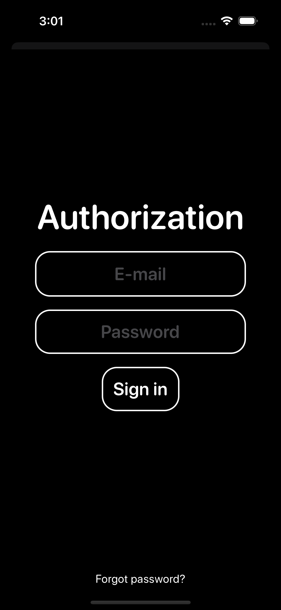

# AnonChats

Where it all started...

## Description

A messenger app for communicating with different people around the world. You can choose a room to enter or create one. Every room has a topic and a title, they can be changed. Room may be added to favorites -> it will appear in favorites tab.\
The app is done with Firebase Auth and Firebase Firestore. It was my first ever app in SwiftUI, so, it has a lot of bad, very bad, code and I think, i wouldn't touch it anymore. It is just easier to write everything again with my new knowledge, new SUI and Firebase features.

## Screenshots

    

    

    

    

    

    

    

    

    

    

## P. S.

The idea for the app came from my school teacher, we were thinking what to make as a project for some school events. Firstly, I made it as a website fully in Python and then, because I've got a Macbook, I thought about creating it as an iOS app. That's where my iOS journey started. 
